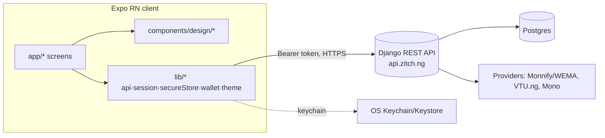
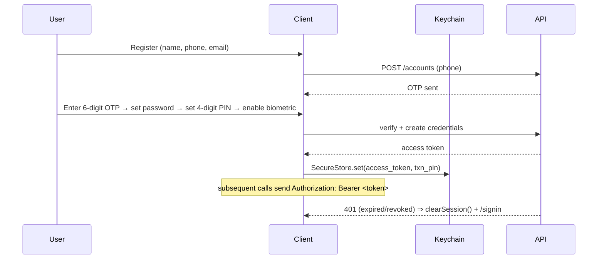
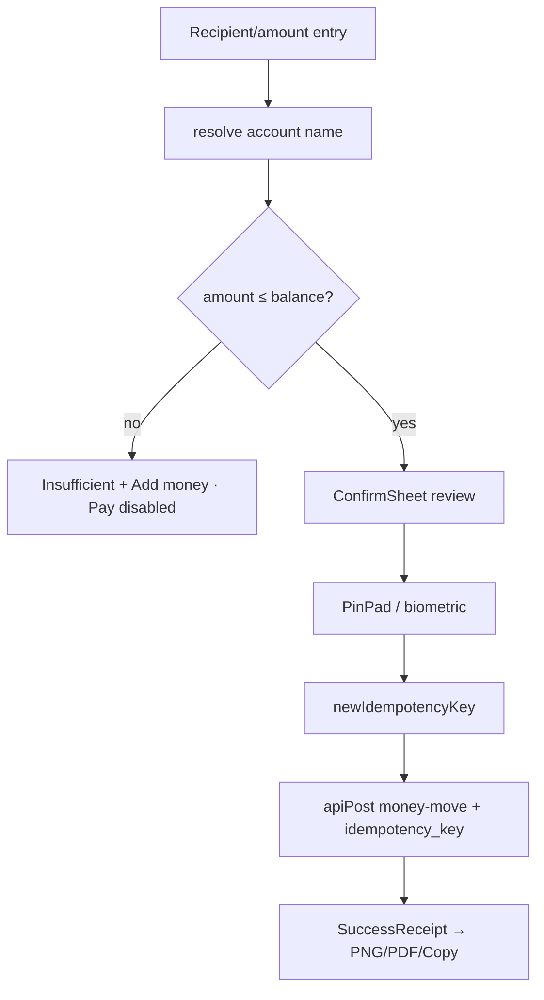

# Zitch — Architecture Audit

**Date:** 2026-06-29 · **Branch:** `new-design-files-v2`
**Stack:** Expo SDK 51 / React Native 0.74 client (expo-router) + Django REST backend, hosted on Render (`render.yaml`), API at `https://api.zitch.ng`.

---

## 1. Overview

Zitch is a Nigerian fintech app: wallet, bank transfers, bill payments, virtual cards, savings & loans, WhatsApp banking, and KYC. Two tiers:

- **Client** — Expo RN app in `app/` (file-based routing via expo-router) with a bespoke design system in `components/design/`.
- **Backend** — a Django project (`backend/zitch_api`) split into domain apps, exposed as a REST API and consumed through `lib/api.ts`.

---

## 2. Client module map

| Path | Responsibility |
|---|---|
| `app/index.tsx` | Splash (coin-flip loader) + onboarding + boot routing |
| `app/(auth)/*` | Register, OTP, set password/PIN, biometric, sign-in, reset, KYC, account details |
| `app/(homepage)/*` | Tab scenes: home, wallet, cards, me, history, txn detail, notifications, loan, convert |
| `app/(servicesscreen)/*` | Flows: addmoney, sendmoney, bill flows, savings, loans, link bank/WhatsApp, settings, support |
| `app/_layout.tsx` | Providers (Theme, Wallet, NotifyHost), font load, global base text weight, lifecycle lock wiring |
| `components/design/ui.tsx` | Core primitives — `Tap`, `Screen`, `Header`, `Card`, `Btn`, `Field`, `Sheet`, `PinPad`, `TxnRow`, `Money` |
| `components/design/flowkit.tsx` | Bill-flow kit — `ProviderGrid`, `PlanList`, `QuickAmounts`, `Monogram`, `ConfirmSheet`, `BalanceHint` |
| `components/design/widgets.tsx` | `Hero`, `ServiceTile`, `SectionLabel`, `Badge` |
| `components/design/{BottomNav,Sidebar}.tsx` | Raised-WhatsApp tab bar / wide-screen sidebar |
| `components/design/{Receipt,Notify,Brand,ZIcon,Loading,ConnectedAccounts,WhatsAppGlyph}.tsx` | Receipt + PNG/PDF export, toast pill, logo, icon set, loader, linked-bank cards, WA glyph |
| `lib/api.ts` | `apiPost`/`apiJson`, 401 eviction, timeouts, `newIdempotencyKey` |
| `lib/secureStore.ts` | Keychain token + transaction-PIN storage, in-memory cache, `clearSession` |
| `lib/session.ts` | Idle/background lock state machine, external-activity grace |
| `lib/biometrics.ts` | Native (`expo-local-authentication`) + web (WebAuthn) biometric gate |
| `lib/theme.tsx` | Theme provider, design tokens (palette, light/dark, radii, `ICON_COLORS`) |
| `lib/wallet.tsx` | Wallet context — balance, accounts, `showBal`, txns |
| `lib/format.ts` | `money`/`moneyk` (design `fmtN` whole-naira) |
| `hooks/`, `constants/` | Color-scheme hooks; icon/image/color constants |

---

## 3. Backend module map (Django apps in `backend/`)

| App | Inferred responsibility |
|---|---|
| `accounts` | Auth, registration, OTP, profile, KYC tiers |
| `wallet` | Wallet balance, funding, ledger |
| `transfers` | Bank/account resolve, transfers, beneficiaries |
| `cards` | Virtual/physical card issuance & controls |
| `loans` · `savings` | Lending & fixed-save products |
| `betting` · `exams` · `utility` | Bill verticals (betting top-up, exam pins, airtime/data/cable/electricity) |
| `banklink` | Mono bank-linking + linked-account balances |
| `whatsapp` | WhatsApp banking link & messaging |
| `convert` | Currency conversion |
| `admin_api` · `console` · `portal` | Internal admin / ops surfaces |
| `common` · `zitch_api` | Shared utilities; project settings, URLs, middleware |

> See `memory/wema-migration.md` and `docs/wema-api-endpoints.md` for the transfer-provider (Monnify→WEMA/ALAT) work behind the `TRANSFER_PROVIDER` flag.

---

## 4. Dependency graph (key)

**Client:** expo-router (routing) · expo-secure-store (keychain) · expo-local-authentication (biometrics) · react-native-svg (icons/loader) · react-native-reanimated *(present; no babel plugin — animation uses RN `Animated`)* · react-native-view-shot + expo-print + expo-sharing + expo-media-library (receipt PNG/PDF) · expo-image-picker + expo-camera (KYC/scan) · expo-clipboard · @react-native-async-storage/async-storage (non-secret state).
**Backend:** Django + DRF (`requirements.txt`), Postgres, provider SDKs/HTTP (Monnify/WEMA, VTU.ng, Mono).

---

## 5. Authentication flow

Key refs: `app/(auth)/register.tsx`, `otp.tsx`, `setpassword.tsx`, `setpin.tsx`, `setthumbprint.tsx`; storage `lib/secureStore.ts`; eviction `lib/api.ts:onSessionExpired`; lock `lib/session.ts`.

---

## 6. Transaction / payment flow

Refs: `app/(servicesscreen)/sendmoney.tsx` + bill flows; `components/design/flowkit.tsx` (`BalanceHint`, `ConfirmSheet`); `components/design/ui.tsx` (`PinPad`); `lib/api.ts` (`newIdempotencyKey`); `components/design/Receipt.tsx`.

---

## 7. State management

- **Theme** — `lib/theme.tsx` `ThemeProvider` (`useTheme().c` tokens, persisted in AsyncStorage).
- **Wallet** — `lib/wallet.tsx` context: balance, linked accounts, `showBal`, txns.
- **Toasts** — `components/design/Notify.tsx` imperative `notify()` + root `NotifyHost`.
- **Storage split** — secrets (token, PIN) in keychain; non-secret (profile, theme, lock flags, last-active) in AsyncStorage.
- No global store library (Redux/Zustand) and no server-cache layer (React Query) — data is fetched per-screen via `apiJson`.

---

## 8. API contract

`apiPost(path, body, timeoutMs=30000)` → adds `Authorization: Bearer`, mirrors token into body for compat, 30s `AbortController`, 401→evict, stamps activity. `apiJson` wraps it and **always resolves** to `{success, message, ...}` — non-JSON/timeout/offline degrade to a uniform `{success:false}` so no screen hangs. Base URL: `EXPO_PUBLIC_API_URL` else `https://api.zitch.ng`, with **release builds forced to HTTPS** (`components/configFiles/apiConfig`).

---

## 9. Architectural observations (non-security)

| # | Observation | Suggested direction |
|---|---|---|
| A1 | No service/repository tier — screens call `apiJson` with string paths inline | Introduce `lib/services/*` (typed endpoints) + a thin repository layer |
| A2 | No server-cache/dedup — refetch on every screen focus | Adopt TanStack Query (Phase 4) for caching, dedup, optimistic updates |
| A3 | Endpoint paths are stringly-typed and scattered | Centralize in an `endpoints.ts` constant map |
| A4 | Data shapes largely untyped (`apiJson<any>`) | Add response DTOs / zod schemas per endpoint |
| A5 | Some duplication across bill flows | Already partly abstracted by `flowkit`; extract a `useBillFlow` hook |
| A6 | Lists use `ScrollView`/`map`, not virtualized | Move long lists (history) to `FlashList` (Phase 4) |
| A7 | No directory-level domain separation (`src/domains`) | Optional Phase-3 restructure — **isolate; high churn, low user value** |

These are **observations**, not defects — the app is coherent and shippable as structured. Phases 3–4 of the remediation program would address A1–A7.
